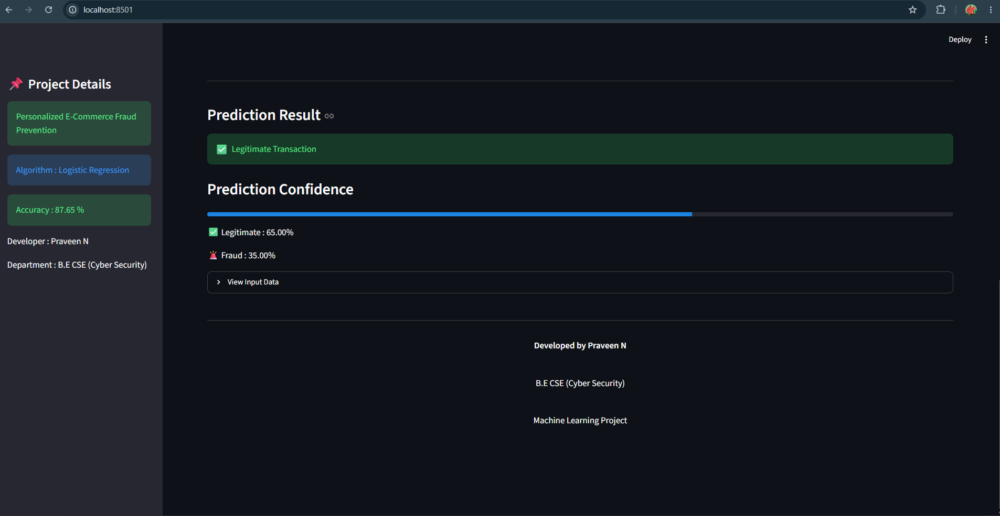

# Personalized E-Commerce Fraud Prevention

A machine learning and deep learning based system for detecting fraudulent e-commerce transactions using multiple classification algorithms and an Artificial Neural Network (ANN).

## 🎯 Project Objective

The objective of this project is to identify potentially fraudulent e-commerce transactions using transaction and customer-related features. The system compares multiple machine learning classification algorithms and uses an Artificial Neural Network for deep learning based fraud detection.

## 🛠️ Technologies Used

- Python
- Pandas
- NumPy
- Scikit-learn
- TensorFlow
- Keras
- Matplotlib
- Seaborn
- Joblib
- Streamlit
- Jupyter Notebook

## 🤖 Machine Learning Algorithms

The following classification algorithms are implemented:

1. Logistic Regression
2. Decision Tree Classifier
3. Random Forest Classifier
4. K-Nearest Neighbors (KNN)
5. Gaussian Naive Bayes

## 🧠 Deep Learning

An Artificial Neural Network (ANN) is implemented using TensorFlow and Keras.

The ANN contains:

- Input Layer
- Dense Hidden Layer – 64 neurons
- Dense Hidden Layer – 32 neurons
- Dense Hidden Layer – 16 neurons
- Output Layer – 1 neuron with Sigmoid activation

The model uses the Adam optimizer and Binary Cross-Entropy loss for binary fraud classification.

## 📊 Model Evaluation

The models are evaluated using:

- Accuracy
- Precision
- Recall
- F1-Score
- Confusion Matrix
- Classification Report

## 🖥️ Streamlit Dashboard

The project includes a Streamlit-based dashboard that allows users to enter transaction details and obtain a fraud prediction.

The dashboard displays:

- Transaction details
- Fraud / Legitimate prediction
- Fraud probability
- Legitimate probability
## Streamlit Dashboard



## 📁 Project Structure
```text
Personalized-Ecommerce-Fraud-Prevention/
│
├── app/
│   └── app.py
│
├── models/
│   ├── ann_fraud_model.keras
│   ├── best_fraud_model.pkl
│   └── scaler.pkl
│
├── notebooks/
│   ├── 01_Data_Understanding.ipynb
│   ├── 02_Data_Preprocessing_Manual.ipynb
│   ├── 03_Model_Training.ipynb
│   └── 04_ML_DL_Fraud_Detection.ipynb
│
├── .gitignore
├── README.md
└── requirements.txt
